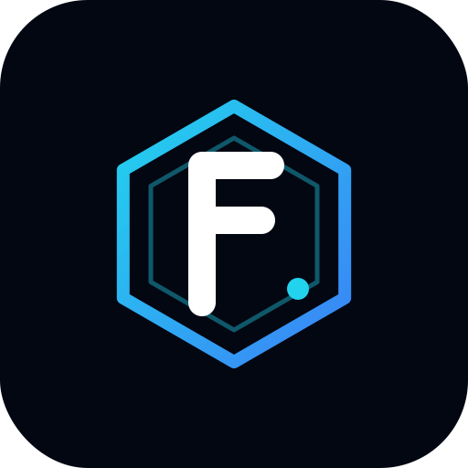

<p align="center">
  
</p>

<h1 align="center">F. R. I. D. A. Y.</h1>

<p align="center">
  <b>Immersive Engineering Visual Intelligence Engine</b><br>
  <i>Design faster. Diagnose visually. Ship engineering concepts at the speed of thought.</i>
</p>

<p align="center">
  
  
  
  
  
  
</p>

---

## What is FRIDAY?

FRIDAY is a **generative immersive visualization engine** that turns natural-language prompts, technical sketches, and voice commands into interactive 3D mechanical assemblies in real time. It's not a chat app - it's a **neural spatial architect** for hardware and engineering teams.

- Speak a system name, watch a 3D model compile in front of you
- Upload a blueprint, get a physics-aware breakdown into sub-assemblies
- Run autonomous diagnostics to flag thermal / mechanical stress points
- Gesture-control the exploded view with your hands
- Share any generation with a URL

## Live demo

**▸ [friday.adityaai.dev](https://friday.adityaai.dev)**

## Tech stack

| Layer | Technology |
|---|---|
| **Rendering** | React 19, Three.js 0.181, @react-three/fiber, @react-three/drei |
| **AI** | Gemini 3.1 Pro Preview (reasoning), Gemini 3.1 Flash (chat + diagnostics), Gemini 3.1 Flash Live Preview (voice) |
| **Voice I/O** | Web Audio API + AudioWorklet, 16 kHz PCM pipeline |
| **Gestures** | MediaPipe Hands (lazy-loaded) |
| **Backend** | Vercel Edge Functions, Supabase Postgres (with RLS) |
| **Animation** | framer-motion |
| **Language** | TypeScript 5.8 (strict) |

## Features

### 🧠 Generative Engineering
- **Text-to-3D** - "Generate a V8 engine" produces 25+ procedurally composed components.
- **Image-to-3D** - Upload a napkin sketch or schematic; vision infers depth and mechanism.
- **Composite geometry** - each component is a stack of primitives (cylinder + torus + box), not a single shape.

### 🩺 Autonomous Diagnostics
- Runs Gemini Flash over the scene graph to surface failure modes.
- Severity-graded anomalies with remediation steps.
- Non-destructive - original model stays intact.

### 🗣️ Multimodal Control
- **Voice** (Gemini Live WebSocket, <700 ms P50 round-trip).
- **Hand gestures** (MediaPipe) - pinch to rotate, spread to explode, fist to reset.
- **Keyboard** - `G` generate, `S` scan, `E` explode, `R` regenerate, `Esc` cancel.

### 🔒 Production-grade Security
- Gemini API key stays **server-side only** (Vercel Edge).
- Gemini Live uses **ephemeral tokens** (10 min TTL).
- Per-IP rate limits (10 Pro / 20 diag / 100 chat / 20 live per period).
- Supabase RLS on all tables. IPs hashed before storage.

## Architecture

See [docs/ARCHITECTURE.md](docs/ARCHITECTURE.md) for the full diagram.

```
Browser SPA ─┬─▶ /api/analyze       ─▶ Gemini Pro
             ├─▶ /api/diagnostics   ─▶ Gemini Flash
             ├─▶ /api/chat          ─▶ Gemini Flash
             ├─▶ /api/live-token    ─▶ Gemini Live (direct WS from browser)
             └─▶ /api/systems/*     ─▶ Supabase Postgres
```

## Local development

```bash
git clone https://github.com/<you>/friday-visual-engine.git
cd friday-visual-engine
nvm use
npm install
cp .env.example .env.local   # fill in keys
npm run dev
```

Open http://localhost:3000. For full backend + edge functions locally, use `vercel dev` instead of `npm run dev`.

## Deployment

One command:

```bash
vercel --prod
```

Full step-by-step (first time only): [docs/DEPLOYMENT.md](docs/DEPLOYMENT.md).

## API reference

See [docs/API.md](docs/API.md) for every edge endpoint, request/response shapes, and rate limits.

## Keyboard shortcuts

| Key | Action |
|---|---|
| `G` | Focus create panel |
| `I` | Focus info panel |
| `L` | Focus logs panel |
| `S` | Deep scan (diagnostics) |
| `E` | Toggle exploded view |
| `R` | Regenerate last system |
| `Esc` | Cancel / deselect |

## Browser requirements

- Chromium 120+ / Firefox 125+ / Safari 17+
- GPU-enabled device recommended (mobile works; laptops shine)
- Camera + microphone permissions for voice & gesture modes

## Contributing

Read [docs/CONTRIBUTING.md](docs/CONTRIBUTING.md). PRs welcome.

## Security

Found a vulnerability? See [SECURITY.md](SECURITY.md).

## License

Apache 2.0 - see [LICENSE](LICENSE).

## Credits

Built by Aditya · Powered by [Google Gemini 3.1 Pro](https://deepmind.google/technologies/gemini/pro/), [Supabase](https://supabase.com), and [Vercel](https://vercel.com).

---

<p align="center"><i>Powered by Gemini 3.1 Pro</i></p>
